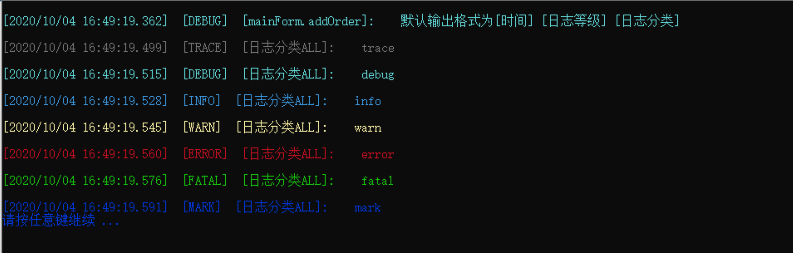
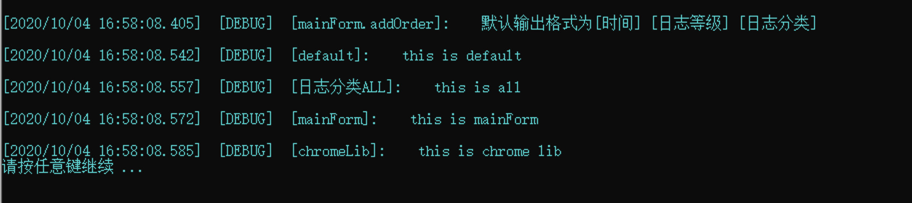

# aardio-log4j 是一个基于log4j理念设计的 aardio 的日志管理库

>log4j有很多版本我参考的版本是[nodejs-log4j]('https://github.com/log4js-node/log4js-node') 得益于aardio全局常量 _STUDIO_INVOKED 实现了默认输出IDE调试下为console ,编译后为 file ,默认文件名defaut,日志输出为多线程加了线程锁保证日志输出不会乱.默认日志滚动为1m，自动清理15天前的日志。

##  目录结构
````
├── log4j
│   ├── Logger.aardio 	       日志类
│   ├── _.aardio               主要函数和变量
│   ├── appenders              要添加的输出 appender 扩展
│   │   ├── _.aardio           主要appends
│   │   └── fileAppend.a       文件append类
│   ├── error.aardio           全局error日志ardio
│   └── layouts.aardio        日志msg格式化
└── log4jTest.aardio           使用示例
````
##  功能列表
* [x] 日志分类输出
    
- [x] 日志等级过滤输出

- [x] 可定义多个输出与多个格式化 laytout

- [x] 定义默认输出，ide环境为console输出，编译后为日志文件输出

- [x] 控制台输出日志

    - [x] 彩色输出
    - [x] 基本的时间与分类显示

- [x] 文件输出
    - [x]  日志文件名自动加上当前日期和.log后缀
    - [x]  日志文件滚动输出
    - [x]  自定义过期日期，自动清理过期日志


## 使用说明
###  1. 基本使用
````
import console;
import log4j;
logger = log4j.getLogger('mainForm.addOrder') //参数为日志分类 
logger.debug('默认输出格式为[时间] [日志等级] [日志分类]')

//修改默认level等级为全部输出,默认日志等级为 "DEBUG" 

log4j.configure({
            level = "ALL";
})
logger = log4j.getLogger('日志分类ALL') //参数为日志分类

logger.trace('trace')
logger.debug('debug')
logger.info('info')
logger.warn('warn')
logger.error('error')
logger.fatal('fatal')
logger.mark('mark')
console.pause(true);
````


> **每个模块都可以自定义分类**
````
import console
import log4j;
logger = log4j.getLogger('mainForm.addOrder') //参数为日志分类 
logger.debug('默认输出格式为[时间] [日志等级] [日志分类]')

//修改默认level等级为全部输出,默认日志等级为 "DEBUG" 

log4j.configure({
            level = "ALL";
})
logger = log4j.getLogger('日志分类ALL') //参数为日志分类
logger1 = log4j.getLogger('default')
logger2 = log4j.getLogger('mainForm')
logger3 = log4j.getLogger('chromeLib')
logger1.debug("this is default")
logger.debug("this is all")
logger2.debug("this is mainForm")
logger3.debug("this is chrome lib")
console.pause()

````



### 2.关掉默认日志输出 
````
log4j.configure({
    	level = 'OFF';
})
````

### 3.自定义输出
````
/**
	新增一个console输出和file输出只记录ERROR以上日志
	新增一个file输出只记录warn以上日志
**/

log4j.configure({
	appenders = {
		appenderName =  {  
			type = 'console'; 
			fileName = 'fileName.log'; 
			layouts = { ['type'] = 'basic'}; 
		};
		fileError = {
			type = 'file'; 
			fileName = 'file1_error.log'; 
			layouts = { ['type'] = 'basic'}; 
		}
		fileWarn =  {  
			type = 'file'; 
			fileName = 'file12_warn.log'; 
			layouts = { ['type'] = 'basic'}; 
		};
	};
	categories = { 
		fileAndConsole =  { appenders = { 'appenderName';'fileError' }; level="ERROR"};
		fileWarn =  { appenders = { 'fileWarn' }; level="WARN"}
	}
})

````

### 贡献
1.  分叉仓库，为您的更改创建功能分支。
2.  在分支上，仅提交对要添加的功能的更改。每个拉取请求应集中于单个更改 - 不要混合使用多个功能。
4.  测试功能合并请求

### 其它
* email: zzerding@foxmail.com

* qq: 377915327

